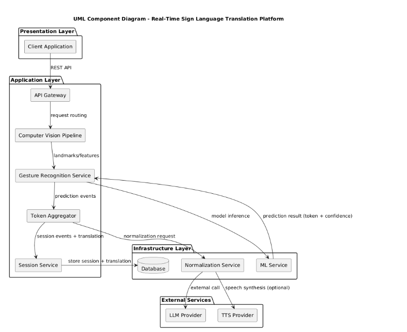
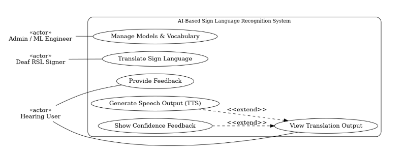
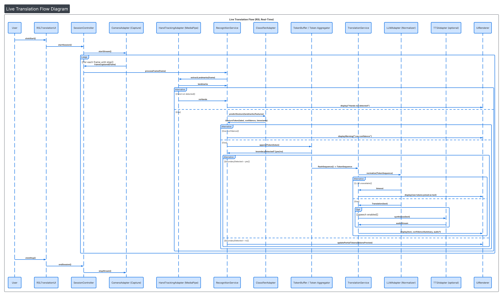
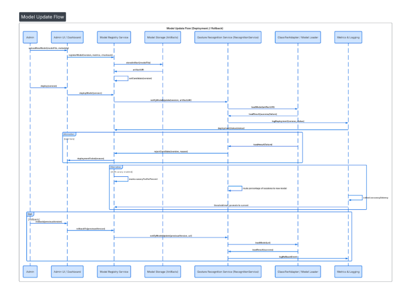
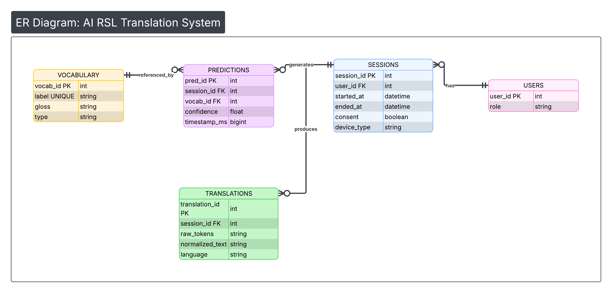

# Software Architecture – Assignment 6 Diagrams

This repository contains architecture diagrams created for **Assignment 6: Creating the Architecture Model**
(course: Software Architecture, APO 3215).

The diagrams correspond directly to the views described in the final PDF report.

---

##  Diagram Overview

### 1. System Context Diagram (C4 – Level 1)
**Purpose:** Shows external actors and systems interacting with the Sign Language Recognition System.

---

### 2. Container Diagram (C4 – Level 2)
**Purpose:** Illustrates the major deployable containers, their responsibilities, and main interactions.

---

### 3. UML Component Diagram (System-Level)
**Purpose:** Shows the system-level component decomposition and dependencies between runtime services.

---

### 4. Use-Case Diagram
**Purpose:** Represents system functionality from the users’ perspective.

---

### 5. Sequence Diagram – Live Translation Flow
**Purpose:** Describes the runtime interaction during real-time sign language translation.

---

### 6. Sequence Diagram – Model Update Flow
**Purpose:** Describes the process of updating and rolling back ML models.

---

### 7. Entity–Relationship (ER) Diagram
**Purpose:** Shows the data model and ownership of key entities.

---

##  Diagram Sources
The diagrams were created using diagramming tools (e.g., draw.io).
Exported PNG versions are provided for easy viewing.
